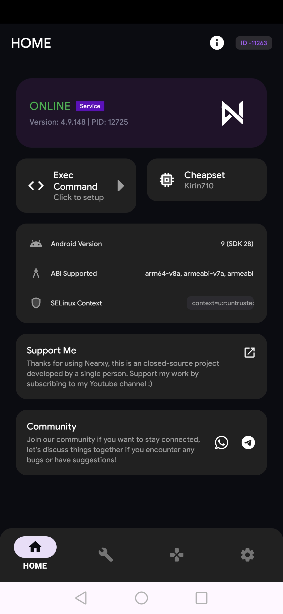
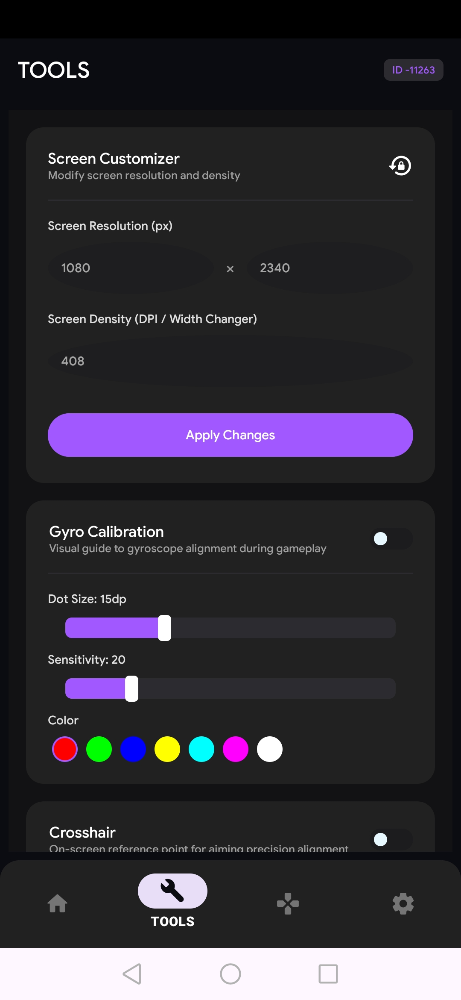
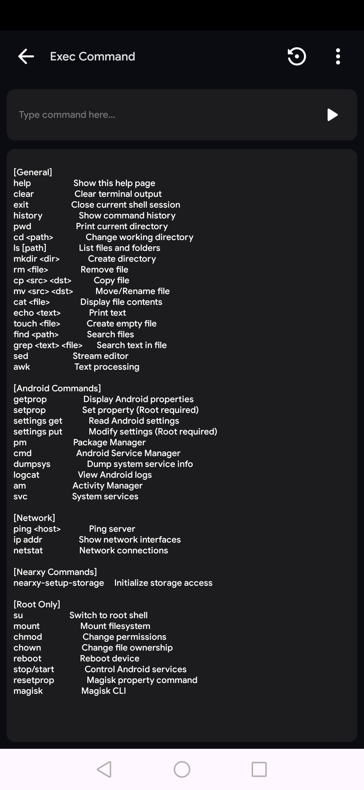
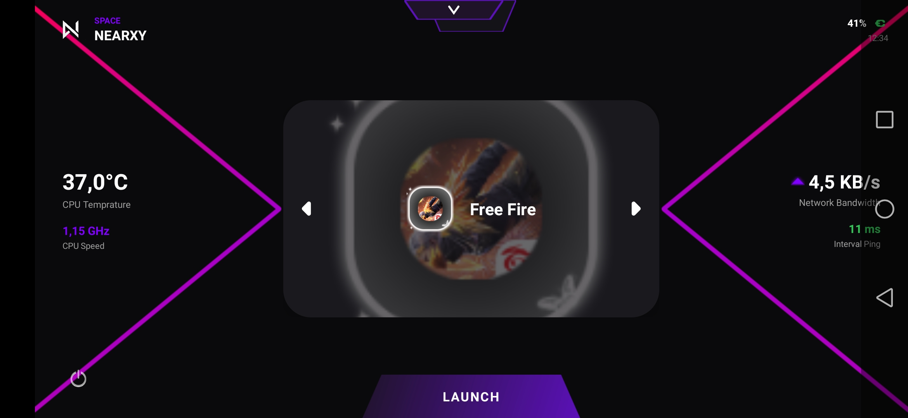

  

  # NEARXY
  ### *The Ultimate Android Gaming Utility & Game Booster*

  
  
  
  

  <a href="#-download--instalasi"><b>Download Latest Version</b></a> •
  <a href="#-fitur-unggulan"><b>Best Feature</b></a> •
  <a href="#-kompatibilitas"><b>Support Device</b></a> •
  <a href="#-komunitas--donasi"><b>Community</b></a>

---

## ❔ Why Choose Nearxy??

Have you ever been having fun *clutch* or dueling 1v1, suddenly your cellphone lagged or *frame dropped* just because there was an application in the background running by itself? Makes you emotional, right?

**Nearxy** is here to solve that problem. It’s not just a superficial "game booster" that merely clears cache for show. Nearxy intelligently shuts down non-essential background services, frees up RAM, and maximizes your phone's chipset performance specifically for the game you're playing. 
> 💡 **Core Function:** Terminates background processes, maintains stable temperatures, and provides pro-level gaming tools—all within a single app.

---

## 🔥 Best Feature

| Feature | Description |
| :--- | :--- |
| 💻 **Command Shell** | It comes with built-in terminal and shell access. You can run custom tweaks and advanced system optimizations to your liking.|
| 🎯 **Custom Crosshair** | Make your aiming in FPS games (PUBG, Free Fire, CODM, etc.) more precise using a custom crosshair overlay with fully adjustable color and shape.|
| 🧩 **Gyro Calibration** | Does your gyro sensor feel laggy or jittery? Recalibrate it using this feature for snappier, more precise aiming.|
| 📊 **Real-time Monitoring** | Monitor FPS, RAM usage, and even your phone's temperature in real-time while gaming.|
| 🧹 **Background Clean Up** | Automatically cleans background services that are greedy for RAM and battery.|

---

## 📱 Device Compatibility

No need to worry about Android versions. Nearxy is designed to be lightweight and highly flexible, supporting everything from older operating systems to the very latest ones:

* 📱 **Android Support:** Android 7.0 (Nougat) into **Android 15**
* ⚡ **Root:** Not mandatory
* 🛡️ **Security:** Malware-free

---

## 📸 Preview

  &nbsp;
  &nbsp;
  &nbsp;
  

---

## 📥 Download & Installation

1. Get the latest official `.apk` file using the button below:
    
   

2. Open the downloaded `.apk` file on your phone.
3. If you get an installation notification from an unknown source (*Unknown Sources*), just allow it, man.
4. Open **Nearxy**, set up your preferred settings, and jump straight into your favorite game!

---

## 💬 Community & Donations

Love the app and want to support its development to make it even better? Feel free to say hi or treat us to a coffee!

* 💬 **Discord Community:** [Join Our_Discord](https://discord.gg/LINK_DISCORD_KAMU)
* ☕ **Donate via Saweria:** [Click Here](https://saweria.co/USERNAME_KAMU)

---

  **Nearxy © 2026** • *Built by @arraydeveloper, For Gamers.*

